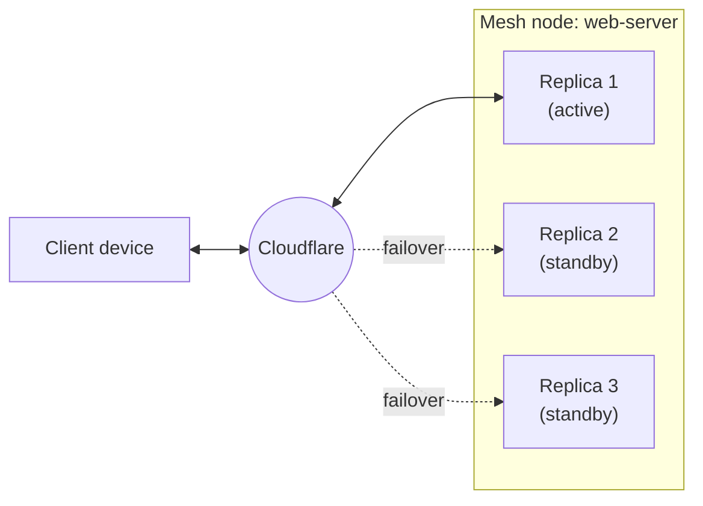

import { Tabs, TabItem } from "~/components";

For production deployments, you can run multiple replicas of a Mesh node in **active-passive** mode. All replicas share the same node identity and advertise the same routes. If the active replica goes down, traffic automatically fails over to a healthy replica.

## How it works

When you create a Mesh node with high availability enabled (the default when using the dashboard), the node is provisioned with a shared token. You install the Cloudflare One agent on multiple Linux hosts using this same token. Each host registers as a replica of the node.

- All replicas advertise the same Mesh IP and CIDR routes.
- One replica is active at a time. The others are passive standby.
- If the active replica disconnects, Cloudflare automatically promotes a passive replica.
- Failover is handled at the Cloudflare edge with no manual intervention.



## Create a node with high availability

When you create a Mesh node through the [dashboard setup wizard](/cloudflare-one/networks/connectors/cloudflare-mesh/get-started/), high availability is enabled by default. The node is created with `ha: true`.

## Add replicas

To add a replica to an existing high-availability node:

1. In the [Cloudflare dashboard](https://dash.cloudflare.com/?to=/:account/mesh), go to **Networking** > **Mesh**.
2. Select your Mesh node.
3. Select **Add a replica**.
4. A dialog will show the install commands and the node's shared token.
5. On a new Linux host, install the Cloudflare One agent and register using the same token:

<Tabs>
<TabItem label="Debian / Ubuntu">

```sh
curl -fsSL https://pkg.cloudflareclient.com/pubkey.gpg | sudo gpg --yes --dearmor -o /usr/share/keyrings/cloudflare-warp-archive-keyring.gpg
echo "deb [signed-by=/usr/share/keyrings/cloudflare-warp-archive-keyring.gpg] https://pkg.cloudflareclient.com/ $(lsb_release -cs) main" | sudo tee /etc/apt/sources.list.d/cloudflare-client.list
sudo apt-get update && sudo apt-get install -y cloudflare-warp
```

```sh
sudo warp-cli connector new <TOKEN> && sudo warp-cli connect
```

</TabItem>
<TabItem label="RedHat / CentOS">

```sh
sudo rpm -ivh https://pkg.cloudflareclient.com/cloudflare-release-el8.rpm
sudo yum install -y cloudflare-warp
```

```sh
sudo warp-cli connector new <TOKEN> && sudo warp-cli connect
```

</TabItem>
</Tabs>

The new replica will appear on the node's detail page in the dashboard. It will be in standby mode until the active replica disconnects.

## View replicas

On the Mesh node detail page, the **Overview** tab shows all registered replicas and their status (active or standby).

## Considerations

- High availability is set at node creation time and cannot be changed afterward.
- All replicas must be on the same subnet and have the same network routing configuration (Split Tunnels, static routes) for seamless failover.
- Failover time depends on how quickly Cloudflare detects the active replica has disconnected (typically seconds).
- If you only have one replica, high availability is effectively disabled. You must install the agent on at least two hosts for failover to work.
