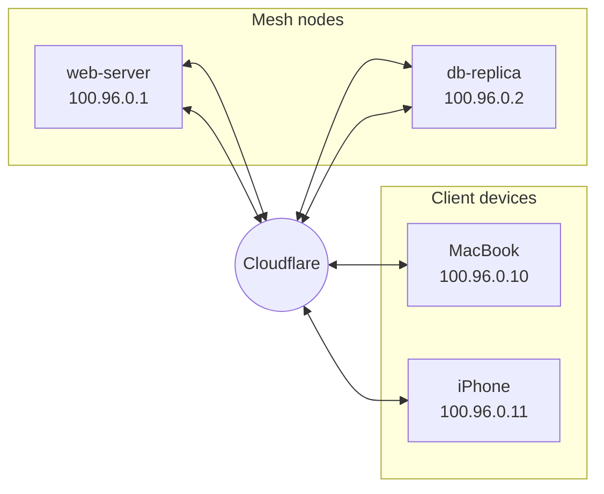

import { Render, Details } from "~/components";

Cloudflare Mesh is private networking built on Cloudflare's global network. It connects your servers, user devices, and cloud workloads into a single private network where every participant can reach every other participant over private IPs, with traffic routed through Cloudflare across 330+ cities.

Mesh replaces the need for VPNs, manual SSH tunnels, or exposing services to the public Internet. You install one lightweight connector on each machine, and Cloudflare handles routing, NAT traversal, and security enforcement.

:::note
Cloudflare Mesh is the successor to WARP Connector and peer-to-peer connectivity. If you previously deployed WARP Connectors, they are now called **mesh nodes**. The WARP client is now the **Cloudflare One Client**.
:::

## How it works

Cloudflare Mesh has two types of participants:

- **Mesh nodes** are your servers, VMs, and containers. They run a headless instance of the [Cloudflare One agent](/cloudflare-one/team-and-resources/devices/cloudflare-one-client/) (`warp-cli`) on Linux and receive a [Mesh IP](#mesh-ips). Nodes can also route traffic for entire subnets behind them using [CIDR routes](/cloudflare-one/networks/connectors/cloudflare-mesh/routes/).
- **Client devices** are your laptops, phones, and desktops. They run the [Cloudflare One Client](/cloudflare-one/team-and-resources/devices/cloudflare-one-client/) and receive a Mesh IP. Users and their local agents (coding assistants, AI tools) use this connection to reach Mesh nodes.

Once connected, any participant can reach any other participant by its Mesh IP over TCP, UDP, or ICMP. All traffic routes through Cloudflare's edge network, so your existing [Gateway policies](/cloudflare-one/traffic-policies/network-policies/), [device posture checks](/cloudflare-one/identity/devices/), and access rules apply automatically.

## Mesh IPs

Every Mesh node and client device is assigned a private IP address from the `100.96.0.0/12` range (configurable). These addresses are sometimes called device IPs or virtual IPs in other parts of the Cloudflare One documentation. In the context of Mesh, they are referred to as **Mesh IPs**.

Mesh IPs are drawn from the [CGNAT address space](https://datatracker.ietf.org/doc/html/rfc6598), which avoids conflicts with most private network ranges (RFC 1918). You can view a device's Mesh IP on the [Mesh overview page](https://dash.cloudflare.com/?to=/:account/mesh) in the Cloudflare dashboard, or by running `warp-cli status` on the device.

For details on the reserved IP ranges used by Cloudflare, refer to [Reserved IP addresses](/cloudflare-one/networks/routes/reserved-ips/).

## Mesh vs. Tunnels

Both Cloudflare Mesh and [Cloudflare Tunnel](/cloudflare-one/networks/connectors/cloudflare-tunnel/) connect private infrastructure to Cloudflare, but they serve different purposes:

| | Cloudflare Mesh | Cloudflare Tunnel |
|---|---|---|
| **Traffic direction** | Bidirectional, many-to-many | Unidirectional, client-to-server |
| **Addressing** | Every participant gets a Mesh IP | Server-side only, no client IPs |
| **Use case** | Private networking between nodes and devices | Expose specific services to clients or the Internet |
| **Connector** | `warp-cli` (Cloudflare One agent) | `cloudflared` daemon |
| **Protocols** | Any TCP, UDP, or ICMP traffic | HTTP/S, TCP, SSH (proxied) |

Use **Mesh** when you need a full private network where any device or node can initiate connections to any other. Use **Tunnels** when you need to expose specific applications or services to users or the Internet without giving those users full network access.

## Where to find Mesh

Cloudflare Mesh lives in the main Cloudflare dashboard at **Networking** > **Mesh** (`dash.cloudflare.com/:account/mesh`). This is separate from the Zero Trust dashboard, though the underlying security controls (Gateway, Access, device posture) are shared.

## Pricing

Cloudflare Mesh is free for up to 50 nodes and 50 users on every Cloudflare account.

## Get started

- [Set up your first Mesh node](/cloudflare-one/networks/connectors/cloudflare-mesh/get-started/)
- [Connect client devices](/cloudflare-one/networks/connectors/cloudflare-mesh/client-devices/)
- [Add routes for subnet access](/cloudflare-one/networks/connectors/cloudflare-mesh/routes/)
- [Enable high availability](/cloudflare-one/networks/connectors/cloudflare-mesh/high-availability/)
