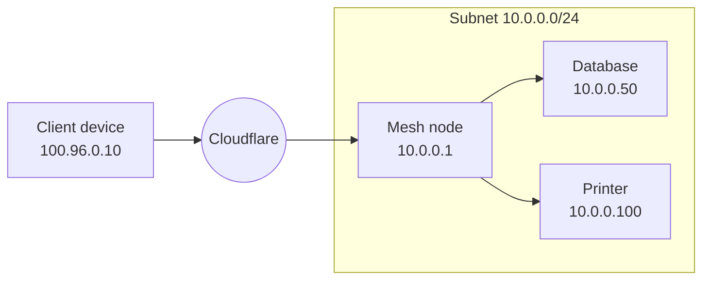

import { Tabs, TabItem } from "~/components";

By default, Mesh nodes are reachable only by their individual [Mesh IP](/cloudflare-one/networks/connectors/cloudflare-mesh/#mesh-ips). If you need other devices on your Mesh to reach hosts on the subnet behind a node (hosts that are not running the Cloudflare One agent), you can add **CIDR routes** to advertise those subnets through the node.

This is the Mesh equivalent of subnet routing. When you add a route, the Mesh node acts as a gateway: traffic destined for the advertised CIDR is forwarded to the node, which then delivers it to the appropriate host on the local subnet.

## When to use routes

- **Without routes**: Devices on your Mesh can only reach the Mesh node itself by its Mesh IP. Services running directly on the node (for example, a database or API server) are reachable this way.
- **With routes**: Devices on your Mesh can reach any host on the subnet behind the node. This is useful when you have multiple servers, IoT devices, printers, or other infrastructure that cannot run the Cloudflare One agent.



## Add a route

### Using the dashboard

1. In the [Cloudflare dashboard](https://dash.cloudflare.com/?to=/:account/mesh), go to **Networking** > **Mesh**.
2. Select your Mesh node.
3. Go to the **Routes** tab.
4. Select **Add a route**.
5. Enter the private CIDR you want to route through this node (for example, `10.0.0.0/24`).
6. Optionally add a description.
7. Select **Save**.

### Using the API

```sh
curl -X POST "https://api.cloudflare.com/client/v4/accounts/{account_id}/teamnet/routes" \
  -H "Authorization: Bearer {api_token}" \
  -H "Content-Type: application/json" \
  -d '{
    "network": "10.0.0.0/24",
    "tunnel_id": "{mesh_node_id}",
    "comment": "Staging subnet"
  }'
```

## Configure Split Tunnels

For traffic to reach your advertised CIDR, the range must route through Cloudflare on both the Mesh node and client devices.

### On the Mesh node

In your Mesh node's device profile, ensure the advertised CIDR routes through the WARP tunnel:

- **Include mode** (recommended for Mesh nodes): Add the CIDR to your include list.
- **Exclude mode**: Remove the CIDR (or its parent range) from your exclude list.

For example, if you are advertising `10.0.0.0/24` and your Split Tunnels exclude list contains `10.0.0.0/8`, you need to remove `10.0.0.0/8` and re-add the portions of the `10.0.0.0/8` range that you do not want to route through Cloudflare.

### On client devices

Repeat the same Split Tunnel configuration on the device profiles used by your client devices, ensuring the advertised CIDR routes through Cloudflare.

## Route traffic from subnet to Mesh node

The Mesh node forwards inbound traffic from Cloudflare to devices on the subnet. However, for **return traffic** (responses from subnet devices back to Mesh clients), the subnet devices need a route back to the Mesh node.

How you configure this depends on where the Mesh node is installed:

### Option 1: Mesh node is the default gateway

If the Mesh node is the subnet's default gateway (or is installed on the router), no additional configuration is needed. All traffic from subnet devices naturally routes through the node.

### Option 2: Mesh node is not the default gateway

If the Mesh node is a regular host on the subnet, you need to configure subnet devices to route Mesh traffic through the node. On the subnet's router, add a static route:

- **Destination**: `100.96.0.0/12` (Mesh IP range)
- **Next hop**: The Mesh node's local subnet IP (for example, `10.0.0.1`)

This ensures that responses to Mesh clients are forwarded to the Mesh node for delivery through Cloudflare.

For traffic from other Mesh node subnets (site-to-site), also add routes for those subnets:

- **Destination**: The remote subnet CIDR (for example, `192.168.1.0/24`)
- **Next hop**: The local Mesh node's subnet IP

## Edit a route

1. Go to **Networking** > **Mesh** > select your node > **Routes** tab.
2. Select the edit icon next to the route you want to modify.
3. Update the CIDR or description.
4. Select **Save**.

## Delete a route

1. Go to **Networking** > **Mesh** > select your node > **Routes** tab.
2. Select the delete icon next to the route.
3. Confirm deletion.

## DNS filtering

If you want to filter DNS queries from the subnet using [Cloudflare Gateway](/cloudflare-one/traffic-policies/dns-policies/), ensure the following IPs route through the Mesh node in your Split Tunnels configuration:

- The subnet's internal DNS resolver IP
- Gateway initial resolved IP range: `100.80.0.0/16` (IPv4) and `2606:4700:0cf1:4000::/64` (IPv6)

Gateway will log DNS queries with the private source IP of the originating device, which you can use to create [resolver policies](/cloudflare-one/traffic-policies/resolver-policies/) for internal DNS records.
